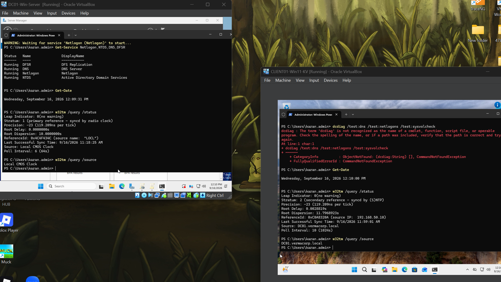

# Troubleshooting: DNS, Time Synchronization, and Group Policy

## Problem

`gpupdate /force` initially failed on `CLIENT01` with messages indicating that the workstation could not connect to or authenticate with the domain controller.

## Initial Checks

The following tests confirmed that basic connectivity was working:

```powershell
ping 192.168.50.10
Test-NetConnection 192.168.50.10 -Port 389
Test-NetConnection 192.168.50.10 -Port 445
nltest /dsgetdc:vermacorp.local
```

The following services were also confirmed as running on `DC01`:

* DNS
* Netlogon
* NTDS
* DFS Replication

The `SYSVOL` and `NETLOGON` shares were available.

## DNS Issue

Because `DC01` had both a NAT adapter and an internal adapter, DNS initially returned multiple addresses for the domain controller, including the NAT address and an IPv6 address.

The client was configured to use:

```text
192.168.50.10
```

as its DNS server, and the domain-controller record was corrected so the client resolved `DC01` through the private lab network.

## Root Cause

The Group Policy operational log contained error code:

```text
0x576
```

This indicates a time and/or date difference between the client and domain controller. The client clock was not synchronized correctly with `DC01`, causing authentication-dependent Group Policy processing to fail.

## Resolution

The client was configured to synchronize time from the domain hierarchy:

```powershell
w32tm /config /syncfromflags:domhier /update
Restart-Service w32time
w32tm /resync /rediscover
```

The time source was verified with:

```powershell
w32tm /query /source
```

The client then reported:

```text
DC01.vermacorp.local
```

as its time source.

After synchronization, the following command completed successfully:

```powershell
gpupdate /force
```

## Lessons Learned

* A successful ping does not prove that domain authentication will work.
* DNS must point domain clients to the domain controller.
* Active Directory depends on accurate time synchronization.
* Group Policy errors may display generic connectivity messages even when the underlying cause is Kerberos time skew.
* Troubleshooting should progress from network connectivity to DNS, service availability, authentication, and event logs.


## Evidence

### DNS server records


*DNS Manager shows the `vermacorp.local` forward lookup zone and DC01 host records.*

### Basic network and DNS validation


*DC01 successfully reached the gateway and Internet and resolved an external DNS name.*

### Client-to-domain-controller DNS validation


*CLIENT01 successfully reached DC01, resolved `dc01.vermacorp.local`, and located the domain controller.*

### Active Directory service status


*The DNS, Netlogon, NTDS, and DFSR services were shown as running on DC01.*

### SYSVOL and NETLOGON validation


*The SYSVOL and NETLOGON shares were available, and SYSVOL path validation succeeded.*

### Successful Group Policy update


*The `gpupdate /force` command completed successfully for both computer and user policy.*

### Applied Group Policy verification


*The `gpresult /r` output confirms that the expected Group Policy Objects were applied to CLIENT01.*

### Time synchronization validation



*The DC01 and CLIENT01 timestamps are closely aligned. CLIENT01 reports `DC01.vermacorp.local` as its time source and references the domain controller at `192.168.50.10`.*

## Evidence Notes

These screenshots document DNS resolution, domain-controller connectivity, Active Directory service availability, SYSVOL and NETLOGON access, Group Policy processing, and time synchronization.

DC01 reports `Local CMOS Clock` as its time source, while CLIENT01 synchronizes from DC01. This is acceptable for the isolated lab unless an external NTP source is later configured.

